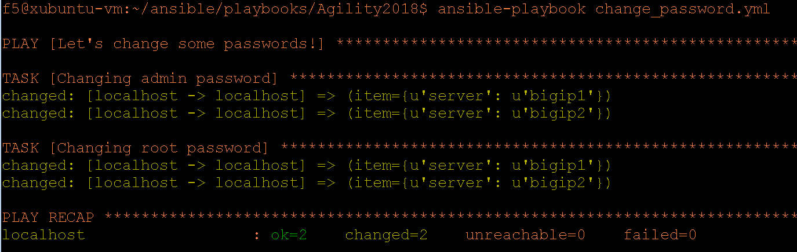

**Last Revised on April 8\ :sup:`th`, 2018**

**Version 1.2**

|image0|

Administrating

F5 with Ansible

**Document Owners: **

**Mark Lowcher**

1. .. rubric:: *Connecting to your Lab environment*
      :name: connecting-to-your-lab-environment
      :class: H1

   1. .. rubric:: Lab Topology
         :name: lab-topology
         :class: H2

There are 4 virtual machines in your cloud lab. Every student will have
their own lab environment with the same ip addressing. Connection to the
Lab environment will be to a Windows Jump server. Access to the other
virtual machines will be from the jump server. The screenshot below
shows the layout of the lab.

The ip addressing for all the virtual machines is shown on the diagram.

|image1|

Connecting to the jump server
-----------------------------

Start an RDP connection to the FQDN that I sent you in an email last
night. This will be your Jump server.

Logon is:

-  Username: user

-  Password: Agility1.

Once your Remote Desktop session has started. You may access both Bigips
GUI using the shortcuts seen in the Chrome browser on your Windows
desktop.

|image2|

You can also access the Ansible machine and both Bigips through the
Putty on the desktop.

|image3|

1. .. rubric:: *Lab 1 - Ansible Setup*
      :name: lab-1---ansible-setup
      :class: H1

   1. .. rubric:: Setting up the Connectivity between Ansible and the
         F5s.
         :name: setting-up-the-connectivity-between-ansible-and-the-f5s.
         :class: H2

Using putty on your Windows desktop, start an SSH session to the Ansible
machine.

We will configure Ansible for use with our bigips.

Use your favorite linux editor to open the /etc/ansible/hosts file.
There is a top section named [bigip] underneath this heading are
connection parameters for Ansible to use to connect to managed devices.

Ansible can be used to configure almost any device you want. In a
production network you might have other headings in this file such as
[database], [webservers] [cisco\_switches] etc…

You will notice that the first entry is commented out with a hashtag.
This is just an example to show you how to set up connectivity to a
managed device using public/private key pairs. For this lab we will be
connecting using a username and password. The username and password
currently configured is for the default credentials of a bigip.

Notice that we have two bigips defined, bigip1 and bigip2. We also have
“ansible\_host=” twice, once for each device. This will allow us to
target a specific bigip by using bigip1 or bigip2 in our playbooks. Or
for plays that will address both systems at the same time we can target
“ansible\_host”. The other parameters tell Ansible how to connect to
these devices. In this case SSH. Ansible supports other protocols such
as netconf and https but for the scope of this lab we will stick with
ssh. Close this file.

|image4|

Now open and inspect the /etc/hosts file.

The /etc/ansible/hosts and /etc/hosts files work together to let us use
names when addressing the F5s with Ansible. Close this file.

|image5|

Now test connectivity to the F5s using the following command.

*ansible -m ping bigip*

Ansible “ping” does not do an ICMP ping but rather looks at the
/etc/ansible/hosts file for connectivity information. In this case it
will create an SSH connection to both F5s using the username and
password specified and verify that Ansible can successfully interact
with the F5s.

|image6|

Since the Ansible workstation has never connected to the F5s, this will
fail.

From Ansible, ssh as root to each of your bigips with password “default”
and type yes to accept the RSA fingerprint.

Example: *ssh root@bigip1*

|image7|

Now retry the *ansible -m ping bigip command*.

|image8|

Now Ansible can communicate with the F5s.

Review the ansible.cfg Config File
----------------------------------

Open the ansible.cfg file:

*sudo vi /etc/ansible/ansible.cfg*

Certain settings in Ansible are adjustable via a configuration file
(ansible.cfg). The stock configuration should be sufficient for most
users, but there may be reasons you would want to change them. Take a
quick look through the file to familiarize yourself with it. We will
make a change to it in a later lab.

Ansible Playbook Setup
----------------------

~~~~~~~~~~~~~~~~~~~~~~~~~~~~~~~~~~~~~~~~~~~~~~~~~~~~~~~~~~~~~~~~~~~~~~~~~~~~~~~~~~~~~~~~~~~~~~

*Note: Section 5.3 has already been completed for you in this lab.
Proceed to Lab 2 – Changing the default passwords*

*~~~~~~~~~~~~~~~~~~~~~~~~~~~~~~~~~~~~~~~~~~~~~~~~~~~~~~~~~~~~~~~~~~~~~~~~~~~~~~~~~~~~~~~~~~~~~~*

From the https://github.com/mlowcher61 site download all the Ansible
playbooks located under f5-Ansible.

Upload all the playbooks to the ~/ansible/playbooks directory in the
Ansible system using the following command.

Run “sudo git clone
`**https://github.com/mlowcher61/F5-Ansible.** <https://github.com/mlowcher61/F5-Ansible.git>`__\ `**git** <https://github.com/mlowcher61/F5-Ansible.git>`__

This will place all playbooks in ~/ansible/playbooks/F5-Ansible
directory. We want to move them up one directory and then delete the
F5-Ansible directory.

Run “cd F5-Ansible”

Run “sudo mv ./\* ../”

Lab 2 – Changing the default passwords
======================================

Since our lab is open to the internet we will want to change the default
passwords before we license the devices. A brand new bigip will have the
following default users and credentials.

-  Https GUI access

   -  Username: admin

   -  Password: admin

-  SSH CLI access

   -  Username: root

   -  Password: default

From the Ansible CLI cd into the ansible/playbooks/Agility1 directory.
This is where all the playbooks are. Open the change\_password playbook.

You will remember that we set the credentials for Ansible to use in the
/etc/ansible/hosts file. Ansible uses SSH to connect to the bigips so we
used the CLI credentials of root/default. The F5 modules use the GUI
credentials when they access the bigip which by default is admin/admin.

Notice under the line “vars” We are setting variables for our playbook.
The F5 module requires the GUI credentials to be set within the module.
The username and password variables are using our current GUI
credentials of admin/admin. Since we will be using both the root and
admin accounts in our plays we will want to change the passwords for
both accounts.

The first play in the change\_password playbook is going to change the
password for the admin account. It will replace it with our variable
“newpass”. That variable is set to make the new password “Agility1”.

The second play is going to change the root password. Notice that the
“password” in our module changed from the variable “{{password}}” to
“{{newpass}}” We changed the password in the previous play, so we had to
change it in this play or the playbook would not successfully complete
the second task.

From the CLI run the following command:

*ansible-playbook change\_passwords.yml*

Your play recap should look like the following.

|image9|

Now that the passwords for both accounts have been changed on both
devices we need to update our /etc/ansible/hosts file and change the
password for root from default to Agility1.

Open the /etc/ansible/hosts file and notice at the end of the last two
lines that the password is set to default. Close this file. Now run the
playbook named ansible\_hostsfile\_newpass.yml with the following
command.

*ansible-playbook ansible\_hostsfile\_newpass.yml*

Re-open the /etc/ansible/hosts file. The password has been changed to
Agility1. Close the file and test the connectivity to the bigips.

*ansible -m ping bigip*

You should have two green successful pings.

*Lab 3 – Licensing the Bigips*
==============================

Open the “license\_F5\_pair.yml” playbook. Edit the file by replacing
the existing registration keys with the ones that were provided for you.

Notice the use of bigip[0] to address the first bigip in the
/etc/ansible/hosts file and bigip[1] to address the second bigip. This
tells the playbook to use the first registration key for the first bigip
in the /etc/ansible/hosts file and the second registration key for the
second Bigip. You could also use bigip1 and bigip2. Save and close this
file.

Access the GUI of the bigips from Chrome on the Jump server. Logon is
admin/Agility1. Verify that both your bigips are not licensed.

Both bigip screens should look like below. Notice that both devices have
a hostname of bigip1. This is the default of a fresh installation.
Verify that both show “No license exists for this device” and that the
screen is on the “Setup Utility” wizard.

Log out of the GUI but leave the tabs open.

|image10|

Now go back to your Ansible SSH session and run the
“license\_F5\_pair.yml” playbook with the following command.

*ansible-playbook license\_F5\_pair.yml*.

Below is an example of a successful run.

Notice that changes are shown in yellow and that both devices were
licensed in one pass.

Notice that what was written in the playbook under tasks and after
*-name* is echoed to the screen.

Notice that this playbook is using the Ansible “raw” module rather than
F5 written modules. It is always best to use modules written by the
vendor but in cases where there is no vendor written modules for your
desired task, you can always use Ansible written modules.

At a later time, be sure to go to https://docs.ansible.com to take a
look at all the modules that are available for use.

|image11|

Log back in to the GUI and verify that both bigips no longer show the
not licensed message and that they are both still on the “Setup Utility”
wizard. (this might take a minute as licensing causes some daemons to
restart)

If one or both are not on the setup utility screen you will need to
reset the device(s) to factory default. Use the following Ansible ad-hoc
command. For instance, if the first bigip needs to be reset issue the
following:

*ansible -a ‘tmsh load sys config default’ bigip1*

Native tmsh or bash commands can be run with the ansible -a flag and the
command wrapped in single quotes. At the end you target the systems you
want to address. If you wanted to reset both devices you would change
*bigip1* to just *bigip*. This would then target ALL devices under the
heading of [bigip] in your /etc/ansible/hosts file.

After the command has finished executing, ssh into that device and
verify that the system does not require a reboot. The command line and
the GUI will either show “Active:Standalone” or REBOOT REQUIRED. If it
reads the later, go to the Ansible ssh session and enter the following
ad-hoc command.

*ansible -a ‘reboot’ bigip1 (or bigip2 of bigip if both need it.)*

Notice the time saved and ease of using Ansible ad-hoc commands for one
off commands.

Go into each GUI and verify that both bigips are now at the “System
Utility” wizard and the no license message is gone and there are no
reboot required messages.

*Lab 4 – Creating a High Availability Configuration*
====================================================

There are over 70 steps to configuring bigips into an active/standby
pair. Network configuration is unique to each device and must be
addressed independently. Once an HA configuration has been completed all
other configurations can be made on one device and “config synced” to
the other device. (Except for any changes made to the network portion of
the configuration.)

Review the Variables in the f5\_active-standby.yml Playbook
-----------------------------------------------------------

The f5\_active-standby.yml playbook will perform all the tasks to bring
a newly licensed pair of bigips to an active/standby state. This
playbook is already properly configured for your environment. You should
however open it up and go through the file from top to bottom to
understand what is going on.

Notice at the top under “vars” all the variables that will be used in
this playbook. Variables can be in the playbook itself as in this case.
Or it can be a separate file that is referenced under “vars”

You could also change “vars” to “vars\_prompt” and the user executing
the playbook would be prompted for an answer to each variable before the
playbook is run.

Notice that under “tasks” are each of the “plays” in the playbook. A
description of the play is written after *-name*. This portion will be
echoed to the screen during runtime to help you follow what is going on
during runtime.

Notice that this playbook is using all F5 written modules rather than
native Ansible modules.

Most F5 modules are “idempotent” except for the ones that are used to
issue native tmsh or bash commands. So the “bigip\_command” or
“bigip\_raw” F5 modules would be idempotent for read command but not for
write commands.

Review the Modules used in the f5\_active-standby Playbook
----------------------------------------------------------

Some of the F5 modules used in these labs are still “experimental”. You
can go to https://docs.ansible.com to see all the F5 modules that are
GA. For the ones that are still “experimental”, you can go to the F5
github repository to see them.

Go to https://github.com/F5Networks/f5-ansible and go into the Library
directory and then the modules directory.

Open the bigip\_device\_connectivity.py python file. Looking through
this you can see all the options for this module as well as an example.

~~~~~~~~~~~~~~~~~~~~~~~~~~~~~~~~~~~~~~~~~~~~~~~~~~~~~~~~~~~~~~~~~~~~~~~~~~~~~~~~~~~~~~~~~~~~~~

NOTE: Not all examples are 100%. If you use this example, it will throw
an error stating that maybe you did not turn off certificate checking.
This example should also have a statement at the same indent as password
with “validate\_certs: no”

~~~~~~~~~~~~~~~~~~~~~~~~~~~~~~~~~~~~~~~~~~~~~~~~~~~~~~~~~~~~~~~~~~~~~~~~~~~~~~~~~~~~~~~~~~~~~~

|image12|

Run the f5\_active-standby Playbook
-----------------------------------

Run the f5\_active-standby playbook with the following command:

*ansible-playbook f5\_active-standby.yml*

Watch the TASK messages as the playbook runs to see the configuration
attributes that are occurring. Your play recap should look like below.

|image13|

Log into the GUI of both bigips. You now have an active/standby
configuration with one device as active and the other in standby and
both show “in sync”.

1. .. rubric:: *Lab 5 – Push a Certificate and Key to the Bigip*
      :name: lab-5-push-a-certificate-and-key-to-the-bigip
      :class: H1

   1. .. rubric:: Review the push\_cert\_and\_key\_to\_bigip Playbook
         :name: review-the-push_cert_and_key_to_bigip-playbook
         :class: H2

Open the “push\_cert\_and\_key\_to\_bigip” playbook. Notice that we are
only addressing one bigip in this playbook. The reason is we already
have an active/standby configuration. This means we can now perform all
none network configuration changes on one device and sync that
configuration to the other device.

Notice that there are two tasks or “plays” in this playbook. The first
will be pushing a certificate to the bigip to be used in creating a
clientssl profile so that the application VIP can perform SSL offload.
This play is using the F5 “bigip\_ssl\_certificate” module.

Notice that all the variables are defined under “vars” and that these
variables are called out in the module using the name of the variable in
between quotes and curly braces. “{{ }}” This is a better practice than
hard coding all the variables within the plays themselves. By doing
this, you know you only have to change what is under the “vars” section.

Notice the “content” line in both plays. The certificate and key we will
be using is located under /var/tmp on the Ansible host. Verify that the
certificate and key are in /var/tmp and that the names match the names
defined under the vars section of the playbook.

Once you have confirmed that the variables are correct for your
environment and that the files are located in the proper directory with
the correct spelling, close the playbook.

Now log into the GUI of the both bigips. Go to System -> File Management
-> SSL Certificate List.

Notice that there are 3 default entries but no “RSA Certificate & Key”
named “f5agility2018”

|image14|

Run the push\_cert\_and\_key\_to\_bigip Playbook
------------------------------------------------

Go back to SSH session on the Ansible machine and run the playbook.

*ansible-playbook push\_cert\_and\_key\_to\_bigip.yml*

Did your playbook finish successfully? If so go back to the GUI. Is
there a new entry under SSL Certificate List for f5agility2018?

Re-open the playbook and change the “state” under vars from “present” to
“absent”. Rerun the playbook and check the GUI. Is the f5agility2018
certificate and key gone?

Re-open the playbook and change the state back to present and re-run the
playbook. Verify that the f5agility2018 certificate and key bundle are
back.

Notice in the top left of the GUI that the sync status is “changes
pending”. Log into the second bigip GUI and look at System -> File
Management -> SSL Certificate List. The agility2018 RSA cert/key bundle
is not there.

Run the config-sync playbook.

*ansible-playbook config-sync.yml*

Go back and look at both GUIs. The state has changed to “in sync” and
both devices have the cert/key bundle.

*Lab 6 – Create a clientssl Profile*
====================================

A clientssl profile consists of a digital certificate and a private key.
Adding a clientssl profile to a virtual server will cause the bigip to
decrypt client connections as they come into the VIP.

Now that we have a certificate and key pushed up to the bigip, we can
create a clientssl profile.

Review the create\_clientssl\_profile Playbook
----------------------------------------------

Open the create\_clientssl\_profile playbook. Verify that all the
variables are correct for your environment.

Notice that the variable “cert\_chain” has a placeholder of “xxxxxx” and
that the “chain” under cert\_key\_chain” has been commented out with a
hashtag. That is because we will not be using a chain certificate. If in
the future, you needed to add one you would simply upload it to the
bigip and then enter the correct variable name and uncomment the chain:
"{{cert\_chain}}" line.

Notice the ciphers line. ciphers:
"!SSLv3:!SSLv2:ECDHE+AES-GCM+SHA256:ECDHE-RSA-AES128-CBC-SHA"

We are setting the desired ciphers within the playbook. We are turning
off unsecure ciphers such as SSLv2 and SSLv3 and we are specifying the
list of ciphers that we want to support. This is a secure set of ciphers
that would get your website an A+ rating by SSLlabs.

Go into the GUI under Local Traffic -> Profiles -> SSL -> Client and
look at the existing clientssl profiles. There should be 5 default
clientssl profiles.

Run the create\_clientssl\_profile Playbook
-------------------------------------------

Run the create\_clientssl\_profile playbook. Go back into the GUI of
bigip1 and verify that there is now a new clientssl profile named
“agility2018\_clientssl”.

Click the profile to open it up.

Notice next to “Certificate Key Chain” that the f5agility2018
certificate and key were used for this profile.

Click the “custom” check box on the right to ungray the “Configuration”
section. Now change this section from “basic” to “advanced”.

Notice that a new section popped up under the “Certificate Key Chain”
named “ciphers”.

Notice that instead of the ciphers being “DEFAULT” that they contain the
strong ciphers we specified in the playbook.

*Lab 7 – Provision the ASM Module*
==================================

The bigip is currently only provisioned for LTM. We will be using a WAF
(Web Application Firewall) policy in a later lab which requires the
provisioning of the ASM module (Application Security Module)

 Review the provision Playbook
------------------------------

Go into the GUI of bigip1 and go to System -> Resource Provisioning.
Notice that only LTM is provisioned.

Open the provision.yml playbook. Notice that it contains one play that
will provision ASM onto bigip1.

It uses the F5 bigip\_provision module. This module will not let the
play finish until the bigip is ready to accept another API call. This is
important. If there were other plays in this book we would not want them
to execute until the bigip was ready for the next command. That is the
power of using a specific module rather than a generic module such as
“bigip\_command”. Only use generic modules when the exact one for your
task is not available.

Close the playbook and run it. Notice that it appears to hang . It will
not relinquish to a next task until the F5 is ready to accept it.

~~~~~~~~~~~~~~~~~~~~~~~~~~~~~~~~~~~~~~~~~~~~~~~~~~~~~~

This will take a couple of minutes. Time to get some more coffee!

~~~~~~~~~~~~~~~~~~~~~~~~~~~~~~~~~~~~~~~~~~~~~~~~~~~~~~

Once the play finishes and you see the PLAY RECAP, go back to the GUI of
bigip1.

Go to System -> Resource Provisioning and notice that the ASM module is
now provisioned.

Provisioning a new module re-distributes the memory, CPU and storage, it
also causes the system to restart daemons. You never want to provision
modules during production as this would cause a 1 to 2-minute outage.

You may now move on to the next lab.

*Lab 8 – Adding an Application using an iApp Template*
======================================================

IApp templates are the best practice for configuring application
deployment when using automation. When you deploy with an iApp template,
you define the desired end state and all objects configured for that
application are managed as a “service”. Should you decide to remove the
“service” you can re-run the Ansible playbook that utilized an iApp with
the “state: absent” option. This will remove ALL objects associated with
that “service”. It will not affect the objects that are “network based”
In other words, it your service used vlan 10, it will not remove that
vlan or it’s self ip addresses.

 Review the deploy\_app\_svcs\_waf Playbook
-------------------------------------------

F5 maintains iApp templates and updates them. Your software version will
not have the latest version of an iApp. You should always make sure you
have the latest version of the iApp you will be using.

Most iApps are for deploying a specific application. The iApp we will be
using is maintained and available at F5’s Github repository. It is
called the “F5-application-services-integration-iApp” and can be found
at:

https://github.com/F5Networks/f5-application-services-integration-iApp

This iApp is specifically meant for http/https applications that will
attach layer 4-7 services to the application “service”.

The following link will lead to F5’s Devcentral to download the
documentation of how you can modify the app-svcs iApp to bundle in
various security and authentication policies as well as iRules into your
iApp.

You can then use the modified iApp to deploy a service with the exact
layer 4-7 services you wish to use.

https://devcentral.f5.com/wiki/iApp.AppSvcsiApp_userguide_userguide.ashx

For this lab the app-svcs iApp we will use is already on the Ansible
control machine. It has already been bundled with 3 different “Web
Application Firewall” policies named:

-  Linux-low

-  Linux-medium

-  Linux-high

~~~~~~~~~~~~~~~~~~~~~~~~~~~~~~~~~~~~~~~~~~~~~~~~~~~~~~~~~~~~~~~~~~~~~~~~~~~~~~~~~~~~~~~~~~~~

NOTE: Currently the app-svcs-iapp does not create the clientssl profile
for you. That is why we did so in the previous lab. At a later date the
app-svcs-iapp may be updated to create the clientssl profile for you. If
that happens you would no longer use the “create\_clientssl\_profile”
playbook but you would still use the “push\_cert\_and\_key\_to\_bigip”
playbook to stage the files for the iApp to use.

~~~~~~~~~~~~~~~~~~~~~~~~~~~~~~~~~~~~~~~~~~~~~~~~~~~~~~~~~~~~~~~~~~~~~~~~~~~~~~~~~~~~~~~~~~~~

Now open and review the “deploy\_app\_svcs\_waf” playbook.

Under “vars” you will notice that we will only be addressing one bigip
for reasons described above.

You will need to change the server var to point to one of your bigips.
Lets pick bigip1. Replace the current ip address with 10.1.0.20 or
bigip1 or bigip[0]. Change the policy name to any name you wish.

Notice under the first TASK we will be pushing our iApp to the bigip.
Verify that the iApp we will be pushing out is currently in the correct
directory on the Ansible machine and that the iApp name is correct.

See screenshot below. Also notice that the “state is “present”. If we
wanted to remove the iApp from the bigip we could change “present” to
“absent”.

|image15|

Now look at the second task in the playbook.

|image16|

An iApp template is a list of questions that you answer, and responses
are the variables used to create the service. For automation purposes we
fill out the iApp template in the GUI with our desired options and
deploy the iApp. We can then follow the documentation above from the
app-svcs guide to extract the variables into a json file. This has
already been done and is in the file named waf\_final.json under
/var/tmp in the Ansible virtual machine.

In the

 Review the waf\_final.json File
--------------------------------

Open the waf\_final.json file and review it.

-  Which ASM policy is currently defined to be attached the application?
   Low, medium or high?

-  Are there any pool members defined? How many?

-  Look for clientssl within the file by typing */clientssl* and hitting
   Enter. We want to use the clientssl profile we created earlier named
   “agility2018\_clientssl” Is that the clientssl currently entered to
   be used?

-  Type */.crt* and hit Enter. Is the file configured to use the correct
   certificate?

-  Type */.key* and hit Enter. Is the file configured to use the correct
   key?

-  Go through the rest of the file and notice how all our profiles are
   already defined. For TCP profile we have tcp-lan-optimized, for SNAT
   we have “automap” defined.

-  Go back to the top of the file and type */vs\_Name* and hit Enter.
   The current name of the VIP is “cust7\_waf” Change the vip name to
   one of your choosing. Save and close the file.

   1. .. rubric::  Run the deploy\_app\_svcs\_waf Playbook
         :name: run-the-deploy_app_svcs_waf-playbook
         :class: H2

Go into the GUI of bigip1. Go to iApps -> Application Services. Notice
that the Application Services currently has no applications.

|image17|

Run the deploy\_app\_svcs\_waf playbook.

-  Go back into the GUI of the bigip1 and into iApps -> Application
   Services. You should now see one application that used the
   appsvcs\_integration\_v2.0.004\_test iapp.

-  Click on the application name. You can see all the components that
   were created when the playbook was run.

-  Click on the “reconfigure” tab up top. You now see the iApp template
   with all the variables populated from the waf\_final.json file.

-  Go to Local Traffic -> Network Map. Notice that two vips were
   created. One is a port 80 vip with an irule that does a redirect to
   the port 443 vip. This is to catch users that may enter HTTP into
   their browsers rather than HTTPS.

-  Open the https vip and notice all the profiles associated with the
   vip. Remember the SNAT automap in the json file? Notice that SNAT
   automap has been applied.

-  Go to Security -> Application Security -> Security Policies. Notice
   that there are three ASM policies. These are the 3 policies that were
   bundled into the iApp. Notice that the *linux-high* policy is
   currently applied to our application.

-  Go to iApps -> Application Services and re-open the application. You
   are now in the components view we saw earlier. Switch to the
   “Reconfigure” tab. Now you see the iApp populated with all the
   variables from the json file.

-  Scroll down to near the bottom to L7 Policy Rules Action. Change the
   “bundled:linux-high” to “bundled:linux-medium”. Just edit the current
   field by replacing *high* with *medium* then go to the bottom and
   click finish.

    |image18|

-  Once the component view is display again go back to Security ->
   Application Security -> Security Policies. Notice that the *medium*
   policy is now applied to the vip.

-  Go back to the deploy\_app\_svcs\_waf playbook and change the “state”
   under “vars” to “absent”. Notice that the second task uses a variable
   for the state while the pushing of the iApp has the state hardcoded
   to present. By changing the state under vars we will be removing the
   application but we will leave the iApp on the bigip as its state is
   hardcoded

-  Re-run the deploy\_app\_svcs\_waf playbook.

-  Notice the PLAY RECAP is yellow showing that there has been a change.

-  Go back to the iApps applications. Notice that the application
   service is gone.

-  Click on the “Create” button. From the template drop down look for
   the appsvcs\_integration\_v2.0.004\_test iApp. It is still there.

   1. .. rubric:: – Using include to build a workflow
         :name: using-include-to-build-a-workflow
         :class: H2

Open and look at the “include” playbook. Notice that you can “stitch”
your playbooks together to create a workflow. You could also add
individual plays between playbooks.

*Lab 11 – Opening a support case with F5*
=========================================

Opening a support case always involves creating and downloading a qkview
file. And it often involves running a tcpdump and downloading the pcap
file off of the bigip. In this lab we will learn how to do both
programmatically using Ansible.

– Programmatically collecting a qkview for bigip
------------------------------------------------

Review the “fetch\_qkview” playbook. This playbook will create a qkview
.ucs file and place it in the /var/tmp directory on the F5 and then move
it to the Ansible machines /tmp directory.

Check the Ansible /tmp directory and verify that there is no qkview file
name agility\_bkup.ucs.

Run the fetch\_qkview playbook.

Verify that the file now exists in the Ansible /tmp directory.

– Programmatically running and downloading a tcpdump
----------------------------------------------------

Review the “tcpdump\_from\_F5” playbook. This playbook will start a
tcpdump that will run for 60 seconds or until the user hits Ctrl + c
then c to continue. Under vars you define which vlan or interface to
capture on and what capture filter to apply as well as the desired name
for the capture file.

The playbook is currently setup to capture on the ha\_vlan with a filter
to only capture icmp packets.

Start an SSH session to bigip1. Now start a ping to 10.1.30.2. This is
the ha\_selfip on bigip2. You should see successful pings.

Go back to Ansible and run the “tcpdump\_from\_F5” playbook. Once the
screen shows the message, “Pausing for 60 seconds”, wait about 10
seconds and then stop the capture with the Ctrl +c then c to continue
command.

The playbook will stop the capture and move it to the Ansible machine
into the /tmp directory.

Verify that the “packet\_capture\_date\_icmp.pcap” file is in the /tmp
directory.

Read the capture file from the Ansible machine with the following
command:

*tcpdump -r /tmp/ packet\_capture\_date\_icmp.pcap *

You can see the icmp packets in the capture file.

.. |image0| image:: media/image1.jpeg
   :width: 2.72923in
   :height: 2.39167in

.. |image13| image:: media/image14.png
   :width: 6.53194in
   :height: 2.57500in

